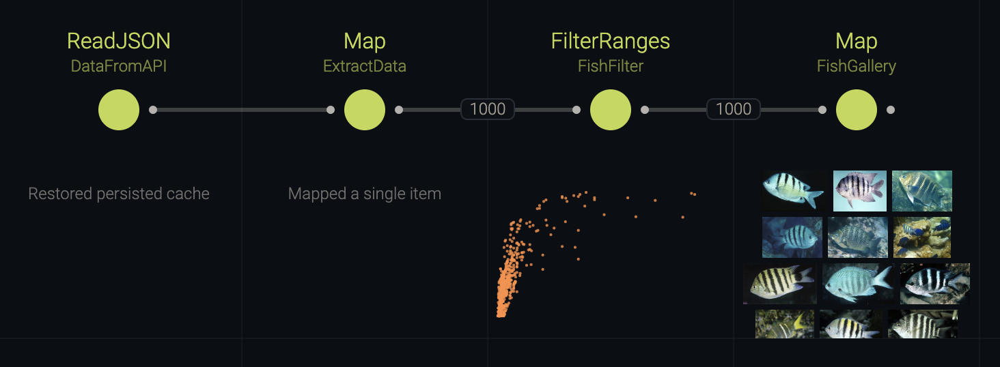
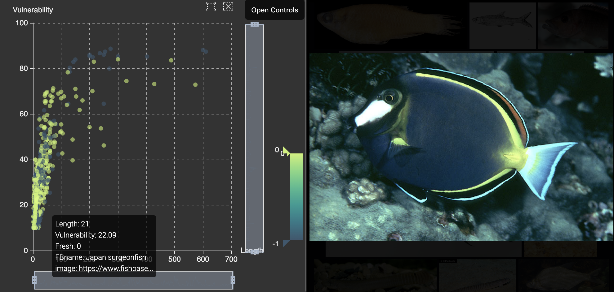
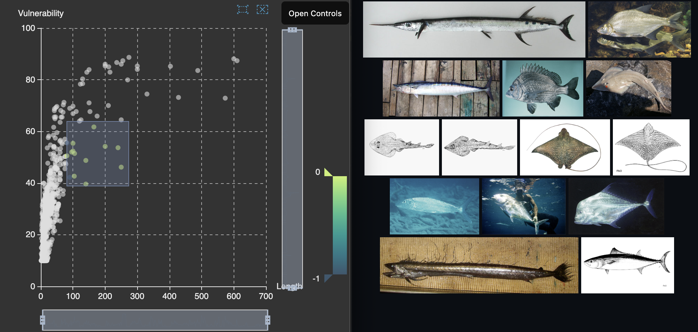

# Brushing & Linking

This example shows how to combine multiple views via [Brushing & Linking](https://en.wikipedia.org/wiki/Brushing_and_linking) in order to selectively visualise fish data queried via [FishBase](http://fishbase.org/).

## Usage

Start the Cocoon editor from the root directory of this repository using:

```sh
npm run example:brushing-and-linking
```



## Highlight Sync

Like in the [simple-api](../simple-api) example we query an open API, extract the data and visualise it in a scatter plot. So far, nothing new. We then visualise fish images in a gallery, using the built-in component (which is very similar to the one we custom-built in the [custom-nodes](../custom-nodes) example).

But it gets interesting once we open both views.

Put them side-by-side and hover an item in the scatter plot. The image of the fish will appear in the Gallery. This is a feature called "Highlight Sync". Cocoon broadcasts information about a highlighted item to all views, and each view can choose to respond with a meaningful action (which can, of course, be customised).



In this particular scenario, the trick is to choose the image attribute as part of the tooltip information:

```yml
FishFilter:
  in:
    data: 'cocoon://ExtractData/out/data'
  type: FilterRanges
  view: Scatterplot
  viewState:
    color: Fresh
    tooltip:
      - FBname
      - image # <-- this contains the image URL
    x: Length
    y: Vulnerability
```

When the Gallery receives highlight information, it scans it for image URLs and shows them in an overlay, simple as that.

## Filtering via Brushing

Note that at the top of the scatter plot you have some toolbox items that you can select. You might not have noticed, but those weren't available in the [simple-api](../simple-api) example. Choosing the first tool allows us to draw a rectangle and only the contained data points will be shown in the gallery.



What's going on?

In order for nodes and views to be able to cooperate, the node specifies a set of features that it supports. The view, in turn, can enable certain features in response if it sees that the node supports them. In this particular instance, the `FilterRanges` nodes supports a view state attribute called `selectedRanges`, which it uses to make range selections on one or more attributes.

As an experiment, you can try replacing the filter node with `FilterRows`. Note that you now have much more granular filtering tools, but the view state serialised in the `cocoon.yml` upon filtering is now a set of indices, not attribute ranges.

## In Summary

Through view state attributes (which both nodes and views can access), views can change the way that nodes behave, which enables features such as visual filtering.

Unlike with Highlight Sync there's no special communication between the two views, however, it is simply a consequence of the regular data flow in Cocoon. The reason there's an instant response when making selections in the scatter plot it simple: the change in view state causes the downstream nodes (`FishGallery` in this case) to invalidate. But invalidated nodes that have a view that is currently opened will cause Cocoon to instantly process the view nodes again. Try closing the Gallery view and note what happens when you make a selection now.
