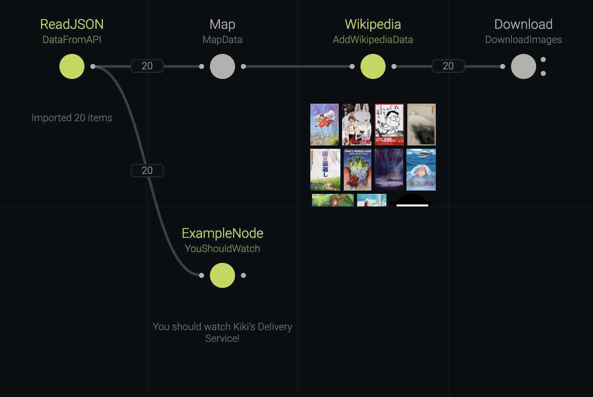
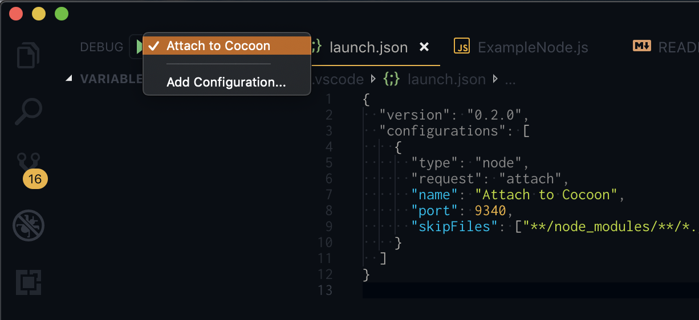

# Custom Nodes and Views

This example queries [Studio Ghibli](https://en.wikipedia.org/wiki/Studio_Ghibli) movies from [ghibliapi.herokuapp.com](ghibliapi.herokuapp.com) and attempts to grab the movie's poster image using the Wikipedia API. The images are then rendered into a custom view.

## Usage

Start the Cocoon editor from the root directory of this repository using:

```sh
npm run example:custom-nodes
```

When making changes to the React components, they need to be bundled again using:

```sh
npm run build
```

> :bulb: **Hint**: If you still have Cocoon running from the first example, you can also just change the URL in your browser to point to the new demo: `/cocoon-demo/examples/custom-nodes/cocoon.yml`



## Custom Nodes

To introduce custom nodes, let's pick a random movie from the data queried via the API. We define our custom node in the `cocoon.yml` like this:

```yml
YouShouldWatch:
  type: ExampleNode
  in:
    data: 'cocoon://DataFromAPI/out/data'
```

When loading a definition file, Cocoon builds a registry of nodes and views. We just have to tell it where it can find the custom `ExampleNode` type in the `package.json` (you'll have to open it in your local code editor):

```json
{
  "cocoon": {
    "nodes": ["nodes/ExampleNode"]
  }
}
```

The JS file essentially just exports an object that wraps a function. Have a look at the [ExampleNode.js](nodes/ExampleNode.js) for a more in-depth explanation. Here is the bare essentials:

```js
// nodes/ExampleNode.js

const _ = require('lodash');

module.exports.ExampleNode = {
  in: {
    data: {},
  },

  async *process(context) {
    const { data } = context.ports.read();
    const randomItem = _.sample(data);
    return `You should watch ${randomItem.title}!`;
  },
};
```

> :warning: **Important**: Make sure that the export name matches the type name.

But that node isn't very useful. The more practical example is [Wikipedia.js](nodes/Wikipedia.js), a node that queries the Wikipedia items so we can add some images to our Ghibli movies. Again, refer to the code documentation for details.

## Custom Views

What if we wanted to preview the images right in Cocoon?

Views are conceptually quite similar to nodes. Like nodes they attach to a port and grab its data. But they then render it into a React DOM to provide interactive visualisations. Nodes are agnostic of their attached views, and vice-versa, so in principle any view can be combined with any node. Though in practice, some views may be tailored specifically to the output of a certain node.

On a technical level, though, views are quite a bit more complicated. Since data processing in Cocoon happens in a Node.js backend process, but rendering in the browser, the browser has no direct access to the data. A view has therefore two components:

- A Node.js module (very similar to the one of nodes) that serialises the data to return only what's necessary for the view, as to minimize the inter-process communication overhead.
- A browser bundle that exports a React component

In the simplest case, we just return the entire data (which is unproblematic for small datasets like the one we're using):

```js
// views/Gallery.js

module.exports.Gallery = {
  serialiseViewData: async (context, data, state) => data,
};
```

That being done, we need an actual React component to do the rendering.

```jsx
// components/Gallery.tsx

import React from 'react';

export const Gallery = ({ isPreview, viewData }) => (
  <>
    {viewData.map(item => (
      
    ))}
  </>
);
```

Since it contains [JSX](https://reactjs.org/docs/introducing-jsx.html) it has to be transpiled, so we do that using [TypeScript](https://www.typescriptlang.org/). Since the code will end up in a browser, it has to be bundled up as well. Cocoon provides a customised [`rollup.js`](https://rollupjs.org/) configuration, see [rollup.config.js](rollup.config.js) for details.

We'll also want to add some styling. Check the code documentation for [components/Gallery.jsx](components/Gallery.jsx) to see how that works.

Lastly, Cocoon needs to know where to find the view. So our `package.json` needs a small update:

```json
{
  "cocoon": {
    "views": [
      {
        "module": "views/Gallery",
        "component": "dist/GalleryComponent"
      }
    ]
  }
}
```

## CLI

If that sounded confusing and/or tedious, here's some good news: all of this can be done automatically via the CLI. Make sure you're in a folder that contains the `package.json` for your Cocoon project and run the `create` command via the CLI:

- Create a new node:

  ```
  npx cocoon create MyNode
  ```

- Create a new node using TypeScript:

  ```
  npx cocoon create MyNode -t
  ```

- Create a new view:

  ```
  npx cocoon create MyView -tv
  ```

> :warning: **Important**: Don't forget to run `yarn build` after adding views or TypeScript nodes, to compile the source, otherwise Cocoon won't be able to read them and show an error. Alternatively, running `yarn dev` will run the compiler in watch mode.

## Debugging

Your custom nodes and views can be debugged by attaching to Cocoon's Node.js process on port `9340`.



For convenience, this example repository includes a [launch configuration](../../.vscode/launch.json) for [Visual Studio Code](https://code.visualstudio.com/) .

## Typings

Cocoon itself is written in [TypeScript](https://www.typescriptlang.org/), and therefore has first-class support for TypeScript typings. In the near future we will have a dedicated example, but in the meantime, here is how you add typings:

### Nodes

```ts
// nodes/FindMeaning.ts

import { CocoonNode } from '@cocoon/types';

export interface Ports {
  data: unknown;
}

export const FindMeaning: CocoonNode<Ports> = {
  in: {
    data: { required: true },
  },

  async *process(context) {
    const { data } = context.ports.read();
    return data === 42 ? `Found meaning` : `Meaningless`;
  },
};
```

### Views

```ts
// views/ShowMeaning.ts

import { CocoonView, CocoonViewProps } from '@cocoon/types';

// The view outputs a string
export type ViewData = string;

// The view state type
export interface ViewState {
  foo: number;
}

// React props which we will use in the view component
export type Props = CocoonViewProps<ViewData, ViewState>;

export const ShowMeaning: CocoonView<ViewData, ViewState> = {
  serialiseViewData: async (context, data: object[], state) => {
    return state.foo === 42
      ? 'the meaning of life'
      : 'the universe and everything';
  },
};
```

### View Components

```tsx
// components/ShowMeaning.tsx

import React from 'react';
import { Props } from '../views/ShowMeaning.ts';

export const ShowMeaning = (props: Props) => {
  const { isPreview, viewData, viewState } = props;
  return <h1>{viewData}</h1>;
};
```

## In Summary

Nodes and views are simple Javascript objects wrapping a function, with views having an additional React component that renders the data.

Cocoon's extensibility is one of its main features and writing custom nodes is the only way to create useful and elegant automation workspaces. While the list of built-in nodes is steadily growing, there's always some business logic that is unique to your particular use-case.

There's more advanced scenarios such as node-view communication in order to create filters visually through a view. They will be introduced bit by bit in other examples, such as [Brushing & Linking](../brushing-and-linking).
