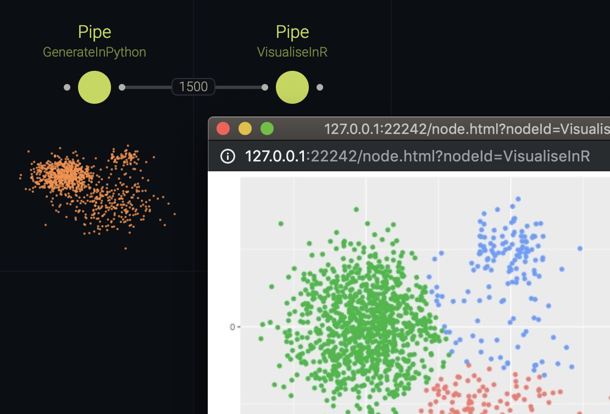

# Interop

This example generates a distribution in Python, then runs a [k-means](https://en.wikipedia.org/wiki/K-means_clustering) clustering algorithm and plots it in R, demonstrating how scripts from multiple languages can be combined in Cocoon.

## Usage

Start the Cocoon editor from the root directory of this repository using:

```sh
npm run example:interop
```

To run all nodes in this example, [Python3](https://www.python.org/downloads/) and [R](https://www.r-project.org/) have to be installed, as well as the [jsonlite](https://cran.r-project.org/web/packages/jsonlite/index.html) and [ggplot2](https://cran.r-project.org/web/packages/ggplot2/index.html) package for R:

```sh
$ r
> install.packages("jsonlite")
> install.packages("ggplot2")
```

## Running Scripts

Cocoon does not try to compete with excellent data science tools such as R Studio, Matlab, or even Excel. Rather, the idea is to provide a bridge between various languages and tools. Fortunately, interoperability in Cocoon is quite easy.



All that's needed is a [Pipe](https://cocoon-docs.aen.now.sh/#pipe) node, which borrows its name from the [Unix pipeline mechanism](<https://en.wikipedia.org/wiki/Pipeline_(Unix)>), since that is what it's using under the hood.

```yaml
GenerateInPython:
  in:
    command: ./generator.py
    data:
      - num_points: 1000
        mu:
          x: 0
          y: 0
        sigma: 0.5
    deserialise: JSON.parse
    serialise: JSON.stringify
  type: Pipe
```

This node essentially executes a shell script and passes arbitrary data via [stdin](<https://en.wikipedia.org/wiki/Standard_streams#Standard_input_(stdin)>). By default, plain strings are passed back and forth, but those values can be serialised and deserialised differently, if necessary.

In this example we pass configurations into a Python script that will generate a number of data points using a [Gaussian function](https://en.wikipedia.org/wiki/Gaussian_function) with different values for mu (the cluster center) and sigma (lower sigma results in a higher density).

```yaml
VisualiseInR:
  in:
    command: ./plot.r
    data: 'cocoon://GenerateInPython/out/data'
    serialise: JSON.stringify
  out:
    src: plot.png
  type: Pipe
  view: Image
```

We then pipe this data into an R script which renders a plot. There's no need to write a complicated custom view: we can simply have the R script render the plot into an image which we then show in `Image` view provided by the `@cocoon/plugin-views` package.

Despite using external scripts, all of Cocoon's mechanism still work as expected: as we change parameters of the Gaussians, our R plot will update in real-time.
