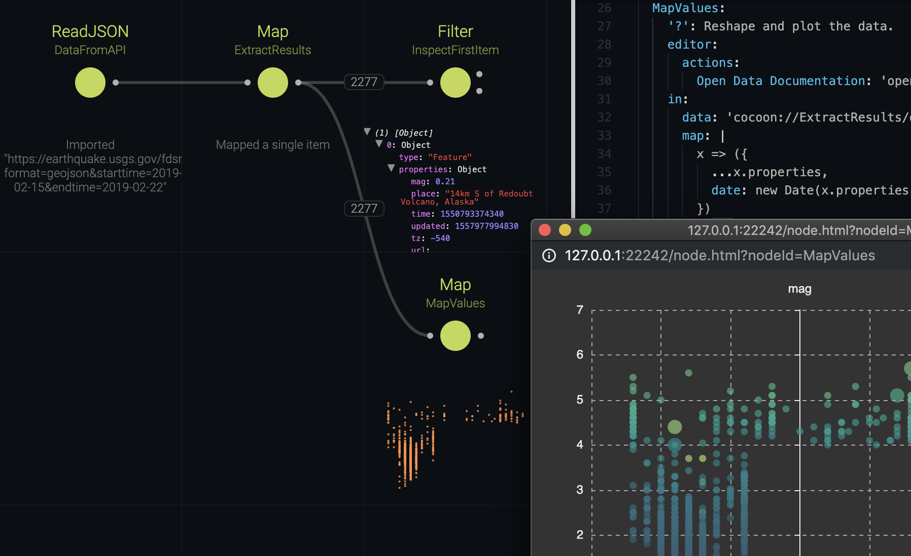

# A Simple API Example

This example retrieves earthquake data from the USGS and plots them in a scatter plot using ECharts. Only built-in nodes are used.

## Usage

Start the Cocoon editor from the root directory of this repository using:

```sh
npm run example:simple-api
```

## Using the Editor

Cocoon will launch a browser that will give you a visual representation of a graph modelled in the `cocoon.yml`.

Data flows from left to right, starting with unconnected nodes, and will be passed along to the connected ports. Nodes are connected via ports, which allows them to have multiple inputs and outputs.

When clicking a node it will be processed, along with all connected nodes that are upstream. Try clicking the `MapValues` node to the right and you should see this:



After processing, every node has a summary underneath, which is either a textual representation of the status or a small rendering of the visualisation output, if the node has a visualisation attached.

## Inspecting Data

Cocoon comes with many ways of inspecting data, but try the following three:

- Open the browser's developer tools and click on a port. You will see the data for that port in the console.

- Right-click the `MapValues` node and choose `Open View` (or press `V` while hovering the node). A new browser window will open, containing a scatter plot showing the node's data.

- Click the `InspectFirstItem` node. Once processed, the `Inspector` visualisation attached to the node will give you a tree view of the data, similar to the browser's inspector. You can interact with it in the summary or choose `Open View` via the context menu.

## Visualising Earthquakes

The example shows how you can easily query an [open API](https://earthquake.usgs.gov/fdsnws/event/1/) for earthquake data and inspect/plot the data.

```yml
DataFromAPI:
  type: ReadJSON
  persist: true
  in:
    uri: 'https://earthquake.usgs.gov/fdsnws/event/1/query?format=geojson&starttime=2019-02-15&endtime=2019-02-22'
```

The built-in `ReadJSON` supports local files as well as parsing a response body via a URI. The `persist` attribute tells Cocoon to create a persistant cache (it will write a JSON file), so we don't have to query the API again when reloading.

The API returns an object wrapping the features, so we connect the `data` port of the `ReadJSON` node to a `Map` node to help us extract the feature array. Let's disect this node's declaration. Click on its title (`ExtractResults`) and the editor will jump to the node as it is defined in the `cocoon.yml`.

```yml
ExtractResults:
  type: Map
  in:
    data: 'cocoon://DataFromAPI/out/data'
    map: x => x.features
```

`ExtractResults` is a unique identifier for the node. Every node has a `type`, which links this node to an implementation (essentially a function mapping input ports to output ports).

The input modes are defined in `in`. A port can either have its data statically typed into the `cocoon.yml`, as is the case with `map`. Here we define a JS callback that re-shapes the data, such that the results attribute is exposed, which contains the array of measurements.

Alternatively, a port can receive a Cocoon URI of the form `cocoon://<nodeID>/out/<portName>`. In this case, the data for that port is pulled from the output port of another node. In the editor, a line is drawn connecting the two ports.

In a similar fashion, the rightmost `MapValues` nodes re-shapes the data to be more plotting friendly. But more interestingly, let's look at the following:

```yml
MapValues:
  type: Map
  view: Scatterplot
  viewState:
    x: tz
    y: mag
    id: title
    tooltip:
      - date
```

The `view` attribute is similar to `type` but attaches an implementation for a visualisation instead. Each visualisation has a default port, which is usually the output `data` port, but we can re-write it to the more explicit form:

```yml
view: out/data/Scatterplot
```

The `viewState` attributes configures the view (and is updated automatically when interacting with the view). In this case, we define what dimension to plot along the scatter plot's X and Y axis and define an additional dimension to be shown in the tooltip, when hovering a data point.

## Experiment!

This concludes the example. Feel free to expand the graph. Just drag and drop a line from the port to an empty tile and choose a node type and port to create and connect. You could, for example, write the data to disk using a `WriteJSON` node.

Hint: to open a node's documentation, press `D` while hovering it.
