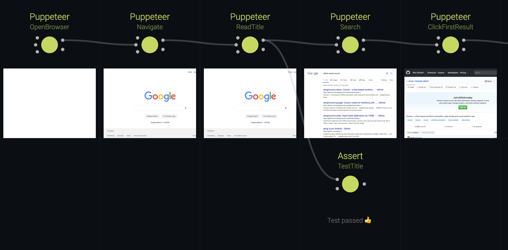

# Testing

This example shows various examples of testing Cocoon nodes and definitions, as well as using Cocoon itself for end-to-end testing.

## Usage

Start the Cocoon editor from the root directory of this repository using:

```sh
npm run example:testing
```

To run the tests in this example, `cd` to the example directory and run:

```sh
npm run test
```

## Testing Nodes

Since Cocoon nodes are functions, they are particularly easy to test. The [@cocoon/testing](https://www.npmjs.com/package/@cocoon/testing) package provides a test helper that automatically creates a dummy context to make unit testing of nodes a trivial matter. Here is an example that uses [AVA](https://github.com/avajs/ava):

```js
import { snapshotNode } from '@cocoon/testing';
import test from 'ava';
import { MyNode } from './MyNode';

test('produces correct output', async t => {
  t.snapshot(await snapshotNode(MyNode, { data: 'foo' }));
});
```

For a complete example, check [Assert.test.js](nodes/Assert.test.js).

## Testing Definitions

Coming soon.

## End-to-end Testing in Cocoon

Cocoon itself can be used as a test runner for complex integration and end-to-end tests. In this example, we create an automated test for a website using [puppeteer](https://github.com/GoogleChrome/puppeteer).

The idea is straightforward: create a browser and page object and pass them through a series of nodes that [execute](nodes/Puppeteer.js) [simple Puppeteer snippets](puppeteer/create.js). The main advantage is that it breaks complicated, long tests into re-usable chunks and allows us to write them bit by bit, without having to re-run the entire test from the start.

As an added bonus, Cocoon can take a screenshot of each step and show it in the editor, produces a nice visual history of the test for free.



Using another custom node ([Assert.js](nodes/Assert.js)) we can check properties through the context.

This example also demonstrates that in Cocoon it's not always necessary to create isomorphic nodes and avoid mutation of port data. While it limits some of its capabilities (persisting and inspecting port data is not possible with non-serialisable data), there are compelling use-cases to do so anyway.

We're certainly not advocating to replace your entire end-to-end test suite with Cocoon, that would most certainly be a questionable move. But Cocoon can help make development of complex tests easier, and the resulting scripts can ultimately just be called like a traditional JS generator function, outside of Cocoon.
